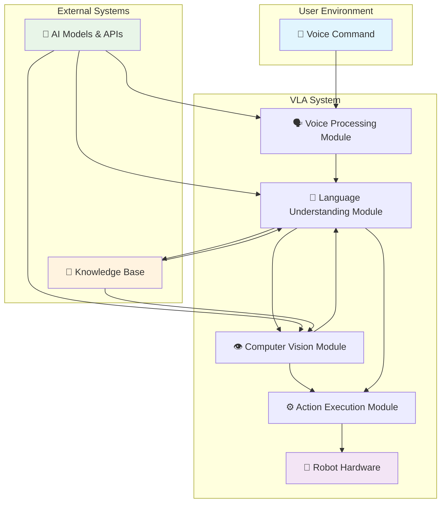
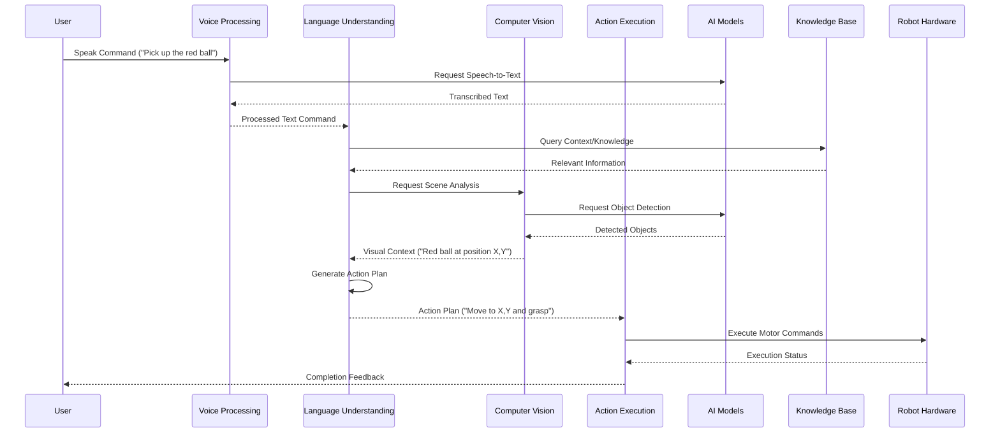
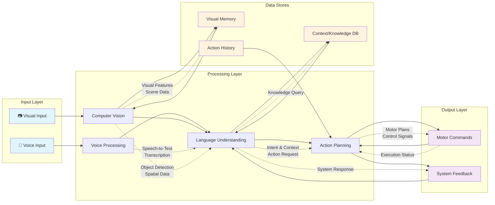
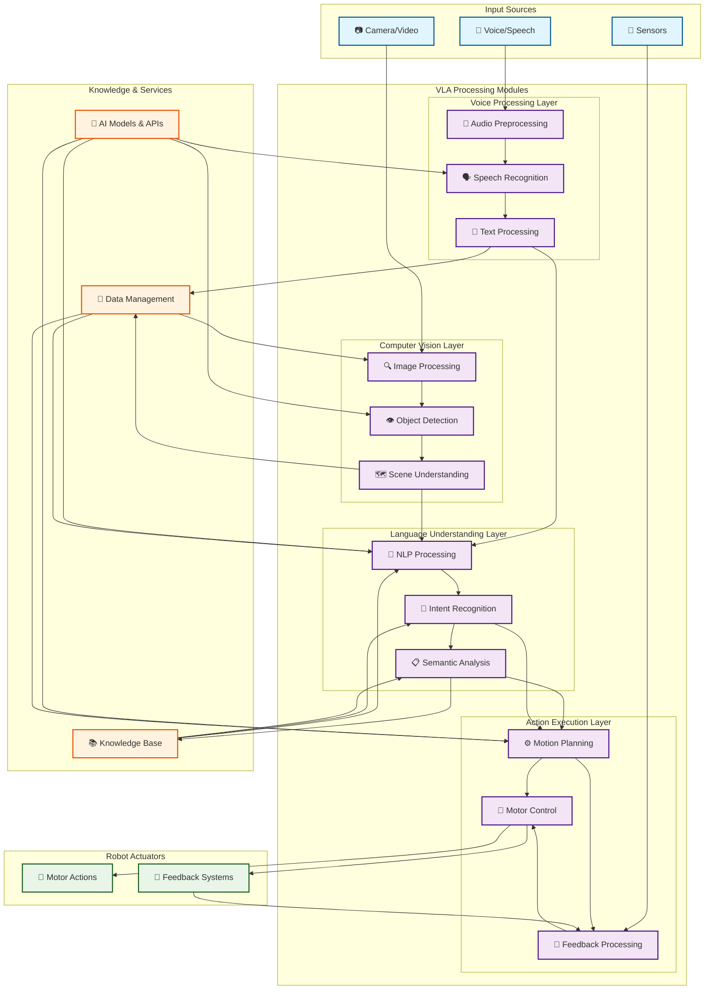

# Vision-Language-Action Architecture

This section describes the architecture of the Vision-Language-Action (VLA) system, which integrates voice processing, language understanding, computer vision, and action execution to enable humanoid robots to understand and respond to voice commands in their environment.

## High-Level System Architecture

The following diagram shows the overall flow from voice input to action execution:



## Component Diagram

This diagram shows the relationships between the different VLA modules:

```mermaid
componentDiagram
    component "Voice Processing Module" as VP {
        interface "I" as VPInput
        interface "I" as VPOutput
    }

    component "Language Understanding Module" as LU {
        interface "I" as LUInput
        interface "I" as LUOutput
    }

    component "Computer Vision Module" as CV {
        interface "I" as CVInput
        interface "I" as CVOutput
    }

    component "Action Execution Module" as AE {
        interface "I" as AEInput
        interface "I" as AEOutput
    }

    component "AI Models & APIs" as AI {
        interface "I" as AIInput
        interface "I" as AIOutput
    }

    component "Knowledge Base" as KB {
        interface "I" as KBInput
        interface "I" as KBOutput
    }

    component "Robot Hardware" as RH {
        interface "I" as RHInput
        interface "I" as RHOutput
    }

    VPInput --> VP : "Voice Input"
    VP --> VPOutput : "Transcribed Text"
    VPOutput --> LUInput : "Text"
    LUOutput --> CVInput : "Context Query"
    LUOutput --> AEInput : "Action Plan"
    CVOutput --> LUInput : "Visual Data"
    KBOutput --> LUInput : "Knowledge"
    KBOutput --> CVInput : "Reference Data"
    AEOutput --> RHInput : "Motor Commands"
    AIOutput --> VPInput : "Model Updates"
    AIOutput --> LUInput : "Model Updates"
    AIOutput --> CVInput : "Model Updates"

    note right of VP
        Speech Recognition
        Noise Filtering
        Voice Activity Detection
    end note

    note right of LU
        NLP Processing
        Intent Recognition
        Semantic Analysis
        Context Understanding
    end note

    note right of CV
        Object Detection
        Scene Understanding
        Visual Recognition
        Spatial Mapping
    end note

    note right of AE
        Motion Planning
        Motor Control
        Feedback Processing
        Safety Checks
    end note
```

## Voice Command Processing Pipeline

The following sequence diagram shows the flow of a voice command through the system:



## Data Flow Diagram

This diagram shows how information moves between different modules in the system:



## Comprehensive Architecture Overview

This detailed diagram shows all components and their relationships in the VLA system:



## Key Components

### Voice Processing Module
- **Audio Preprocessing**: Noise reduction, voice activity detection
- **Speech Recognition**: Converts speech to text using AI models
- **Text Processing**: Cleans and formats the transcribed text

### Language Understanding Module
- **NLP Processing**: Parses and understands the meaning of text
- **Intent Recognition**: Identifies the user's intent from the command
- **Semantic Analysis**: Extracts key information and context

### Computer Vision Module
- **Image Processing**: Preprocesses visual input from cameras
- **Object Detection**: Identifies and localizes objects in the scene
- **Scene Understanding**: Understands spatial relationships and context

### Action Execution Module
- **Motion Planning**: Plans the sequence of movements to achieve the goal
- **Motor Control**: Executes the planned movements on the robot hardware
- **Feedback Processing**: Monitors execution and adjusts as needed

## Data Flow Principles

The VLA system follows these key data flow principles:

1. **Asynchronous Processing**: Modules can process data in parallel where possible
2. **Context Propagation**: Information is passed between modules to maintain context
3. **Feedback Loops**: Results from execution are fed back to improve understanding
4. **Knowledge Integration**: External knowledge sources enhance system capabilities