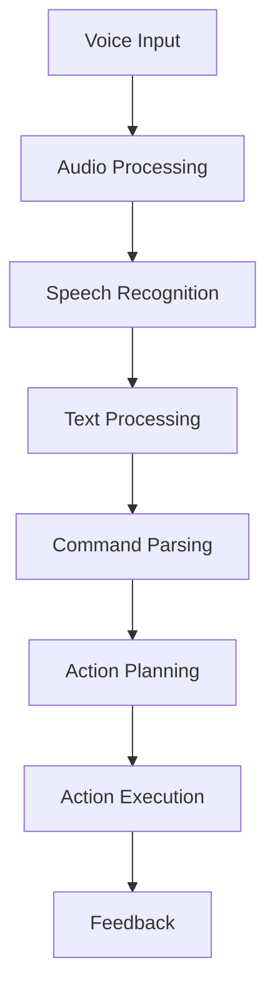
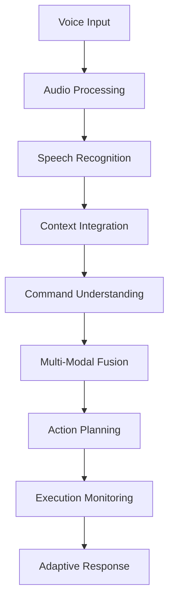

# وائس پروسیسنگ ایکسیمپلز

وژن لینگویج ایکشن (VLA) سسٹم کے لیے وائس پروسیسنگ کے مختلف ایکسیمپلز اور ایپلیکیشنز۔ یہ سیکشن مختلف وائس کمانڈز، ان کی پروسیسنگ، اور نتیجے کے ایکشنز کو ظاہر کرتا ہے۔

## بیسک وائس کمانڈز

### 1. آبجیکٹ مینیپولیشن کے کمانڈز

#### کمانڈ: "Pick up the red ball"
- **وائس ریکوگنیشن**: "pick up the red ball"
- **کمانڈ پارسنگ**:
  - Type: `pick_object`
  - Arguments: `["red ball"]`
- **وژن سلیکشن**: لال گیند کو شناخت کرنا
- **ایکشن**: گیند کو اٹھانا

#### کوڈ مثال:
```python
def process_pick_command(self, object_description):
    """پک کمانڈ کو پروسیس کریں"""
    # وژن سے آبجیکٹ تلاش کریں
    target_object = self.find_object_by_description(object_description)

    if target_object:
        # ایکشن سیکوئنس تیار کریں
        action_sequence = [
            {
                'action_type': 'navigate_to',
                'target_pose': target_object['navigation_pose']
            },
            {
                'action_type': 'approach_object',
                'target_pose': target_object['approach_pose']
            },
            {
                'action_type': 'grasp_object',
                'grasp_pose': target_object['grasp_pose']
            },
            {
                'action_type': 'lift_object',
                'lift_height': 0.1
            }
        ]
        return action_sequence
    else:
        return None
```

#### کمانڈ: "Put the cup on the table"
- **وائس ریکوگنیشن**: "put the cup on the table"
- **کمانڈ پارسنگ**:
  - Type: `place_object`
  - Arguments: `["cup", "table"]`
- **وژن سلیکشن**: کپ اور میز کو شناخت کرنا
- **ایکشن**: کپ کو میز پر رکھنا

### 2. نیویگیشن کے کمانڈز

#### کمانڈ: "Go to the kitchen"
- **وائس ریکوگنیشن**: "go to the kitchen"
- **کمانڈ پارسنگ**:
  - Type: `navigate_to`
  - Arguments: `["kitchen"]`
- **میپ سلیکشن**: کچن کے لوکیشن کو تلاش کرنا
- **ایکشن**: کچن کی طرف جانا

#### کوڈ مثال:
```python
def process_navigation_command(self, location):
    """نیویگیشن کمانڈ کو پروسیس کریں"""
    # لوکیشن کو میپ میں تلاش کریں
    target_pose = self.get_location_pose(location)

    if target_pose:
        # نیویگیشن ایکشن تیار کریں
        navigation_action = {
            'action_type': 'navigate_to',
            'target_pose': target_pose,
            'planner_type': 'global_planner'
        }
        return navigation_action
    else:
        # لوکیشن نہ ملنے پر کچھ اور کریں
        return self.ask_for_clarification(location)
```

## کمپلیکس وائس کمانڈز

### 1. ملٹی اسٹیپ کمانڈز

#### کمانڈ: "Please take the blue pen from the desk and place it in the drawer"
- **وائس ریکوگنیشن**: "please take the blue pen from the desk and place it in the drawer"
- **کمانڈ پارسنگ**:
  - Type: `multi_step_manipulation`
  - Arguments: `["blue pen", "desk", "drawer"]`
- **ایکشن سیکوئنس**:
  1. ڈیسک پر جانا
  2. نیلا پین تلاش کرنا
  3. پین اٹھانا
  4. دراز پر جانا
  5. پین دراز میں رکھنا

#### کوڈ مثال:
```python
def process_multi_step_command(self, action_sequence):
    """ملٹی اسٹیپ کمانڈ کو پروسیس کریں"""
    steps = [
        {
            'action': 'navigate_to',
            'target': action_sequence['object_location']
        },
        {
            'action': 'pick_object',
            'object': action_sequence['object']
        },
        {
            'action': 'navigate_to',
            'target': action_sequence['destination']
        },
        {
            'action': 'place_object',
            'destination': action_sequence['destination']
        }
    ]

    return self.execute_sequential_actions(steps)
```

### 2. کنٹیکسٹ بیسڈ کمانڈز

#### کمانڈ: "Do the same thing again"
- **وائس ریکوگنیشن**: "do the same thing again"
- **کمانڈ پارسنگ**:
  - Type: `repeat_previous_action`
  - Arguments: `[]`
- **کنٹیکسٹ**: پچھلا ایکشن حاصل کرنا
- **ایکشن**: پچھلا ایکشن دہرانا

#### کوڈ مثال:
```python
def process_repeat_command(self):
    """ریپیٹ کمانڈ کو پروسیس کریں"""
    # پچھلا ایکشن حاصل کریں
    previous_action = self.get_previous_action()

    if previous_action:
        # پچھلا ایکشن دہرائیں
        return self.execute_action(previous_action)
    else:
        # کوئی پچھلا ایکشن نہیں، کلئیر کریں
        return self.request_clarification("No previous action to repeat")
```

## وائس کمانڈز کے سیناریوز

### 1. ہوم اسسٹنٹ سیناریو

#### کمانڈ: "Robot, can you bring me my coffee from the kitchen?"
- **اسٹیپس**:
  1. کچن میں جانا
  2. کافی کو تلاش کرنا
  3. کافی کو اٹھانا
  4. صارف کی طرف واپس جانا
  5. کافی ہینڈ کرنا

#### کوڈ مثال:
```python
class HomeAssistantVoiceProcessor:
    def __init__(self):
        self.user_location = None
        self.object_locations = {}
        self.navigation_map = {}

    def process_home_assistant_command(self, command_text):
        """ہوم اسسٹنٹ کمانڈ کو پروسیس کریں"""
        parsed = self.parse_command(command_text)

        if parsed['type'] == 'fetch_item':
            item = parsed['arguments'][0]
            source_location = parsed['arguments'][1] if len(parsed['arguments']) > 1 else 'default'

            # اسٹیپس تیار کریں
            steps = self.create_fetch_sequence(item, source_location, self.user_location)

            return {
                'action_sequence': steps,
                'estimated_time': self.calculate_estimated_time(steps)
            }

    def create_fetch_sequence(self, item, source, destination):
        """فیچ سیکوئنس تیار کریں"""
        return [
            {
                'action': 'navigate_to',
                'target': self.get_location_pose(source),
                'description': f'Go to {source}'
            },
            {
                'action': 'find_object',
                'object': item,
                'description': f'Find {item}'
            },
            {
                'action': 'pick_object',
                'object': item,
                'description': f'Pick up {item}'
            },
            {
                'action': 'navigate_to',
                'target': self.get_location_pose(destination),
                'description': f'Go to {destination}'
            },
            {
                'action': 'deliver_object',
                'object': item,
                'description': f'Deliver {item}'
            }
        ]
```

### 2. ورک پلیس سیناریو

#### کمانڈ: "Please organize the documents on my desk and bring the report to conference room"
- **اسٹیپس**:
  1. ڈیسک پر جانا
  2. دستاویزات کو شناخت کرنا
  3. دستاویزات کو ترتیب دینا
  4. رپورٹ تلاش کرنا
  5. کنفرینس روم میں جانا
  6. رپورٹ ہینڈ کرنا

### 3. کیئر ٹیکنگ سیناریو

#### کمانڈ: "Can you check on my grandmother and bring her medicine?"
- **اسٹیپس**:
  1. دادی کے کمرے میں جانا
  2. حالت چیک کرنا
  3. دوا تلاش کرنا
  4. دوا لانے کے لیے جانا
  5. دوا ہینڈ کرنا

## وائس کمانڈز کی اقسام

### 1. امیر کمانڈز (Imperative Commands)
- "Pick up the book"
- "Go to the bedroom"
- "Turn on the light"

### 2. سوالیہ کمانڈز (Interrogative Commands)
- "Where is my phone?"
- "What time is it?"
- "Can you see the remote?"

### 3. درخواستیں (Requests)
- "Could you please bring me water?"
- "Would you mind closing the door?"
- "Can you help me with this?"

### 4. ایمرجنسی کمانڈز
- "Help me!"
- "Call for help!"
- "Emergency stop!"

## وائس پروسیسنگ کے ورک فلوز

### 1. بیسک ورک فلو



### 2. کنٹیکسٹ اوار ورک فلو



## کارکردگی کے اشاریے

### 1. ایکویسی
- **کمانڈ سمجھنے کی شرح**: > 85%
- **ایکشن کامیابی کی شرح**: > 80%
- **وائس ٹو ٹیکسٹ درستگی**: > 90%

### 2. ریسپانس ٹائم
- **وائس ٹو ٹیکسٹ**: < 200ms
- **کمانڈ پارسنگ**: < 50ms
- **ایکشن پلاننگ**: < 100ms
- **کل سسٹم ریسپانس**: < 500ms

### 3. سیفٹی اور ریلائبلٹی
- **ایمرجنسی کمانڈز**: 100% کامیابی
- **غلط کمانڈز کی شناخت**: > 95%
- **سیف ایکزیکیوشن**: 100%

## ٹیسٹنگ اور والیڈیشن

### 1. ٹیسٹ کیسز

```python
def test_voice_command_examples():
    """وائس کمانڈ ایکسیمپلز کو ٹیسٹ کریں"""
    processor = VoiceCommandProcessor()

    test_cases = [
        {
            'input': 'pick up the red ball',
            'expected_type': 'pick_object',
            'expected_args': ['red ball']
        },
        {
            'input': 'go to the kitchen',
            'expected_type': 'navigate_to',
            'expected_args': ['kitchen']
        },
        {
            'input': 'put the cup on the table',
            'expected_type': 'place_object',
            'expected_args': ['cup', 'table']
        }
    ]

    for test_case in test_cases:
        result = processor.parse_command(test_case['input'])

        assert result['type'] == test_case['expected_type'], \
            f"Expected {test_case['expected_type']}, got {result['type']}"
        assert result['arguments'][0] == test_case['expected_args'][0], \
            f"Arguments don't match for {test_case['input']}"

    print("All voice command examples passed!")
```

### 2. والیڈیشن میٹرکس

- **Semantic Accuracy**: کمانڈ کے مطلب کی درستگی
- **Context Awareness**: کنٹیکسٹ کے مطابق ریسپانس
- **Execution Success**: ایکشن کی کامیابی
- **User Satisfaction**: صارف کی خوشی

## ایڈوانسڈ ایکسیمپلز

### 1. سماجی روبوٹک انٹرایکشن

#### کمانڈ: "Tell me a joke and then clean the table"
- **وائس ریکوگنیشن**: "tell me a joke and then clean the table"
- **پروسیسنگ**:
  - سماجی انٹرایکشن: جوک سناانا
  - ہوم اسٹ میکنک: ٹیبل صاف کرنا

### 2. لائف لارننگ کمانڈز

#### کمانڈ: "Remember that this is my favorite spot"
- **وائس ریکوگنیشن**: "remember that this is my favorite spot"
- **لائف لارننگ**: نیا لوکیشن سیکھنا
- **میموری اپڈیٹ**: صارف کی ترجیحات میں اضافہ

یہ ایکسیمپلز وائس پروسیسنگ کے مختلف پہلوؤں کو ظاہر کرتے ہیں اور VLA سسٹم کے لیے مؤثر وائس انٹرایکشن کے لیے ضروری ہیں۔